# 前言
衰落信道分为两种类型，大尺度衰落和小尺度衰落。

大尺度衰落描述的是收发设备间路径损耗，跟距离，载波频率，障碍物，视距(line of sight)或者非视距(not line of sight)有关。3GPP TR38.901 7.4  Pathloss, LOS probability and penetration modelling定义了不同场景下路损的计算公式。
python实现：py5hphy\channel_model\nr_pathloss_xx.py
大尺度衰落模型一般用于网络规划和系统仿真，物理层链路仿真用到的是小尺度衰落。

小尺度衰落指信号多径传输导致的接收信号合并带来的幅度和相位快速变化。

Rayleign衰落信道和Rician衰落信道是两个最通用的小尺度衰落信道。Rayleign衰落信道是零均值，实部虚部是独立同分布的复高斯信道，信号幅度服从Rayleign分布，Rayleign衰落信道用于NLOS场景。在LOS场景，有直射径存在，信号幅度服从Rician分布，为Rician衰落信道。

无线信道环境可以认为是多径信道，每一径的分布为Rayleign衰落信道或Rician衰落信道。

3GPP TR38.901 7.7 Channel models for link-level evaluations介绍了两种无线信道环境模型：CDL model and Tapped Delay Line (TDL) models model。本项目实现了TDL model。
3GPP提供了5中TDL model from TDL-A to TDL-E，每种TDL模型提供了每一tap的相对时延，功率，以及Rayleign衰落信道或Rician衰落信道模型。每种TDL model代表一种频域上信道变化的快慢。

上面介绍的时单入单出(SISO)信道,MIMO信道可以认为是由$N_tN_r$个SISO信道组成，其中$N_t$为发送天线个数，$N_r$为接收天线个数。生成MIMO信道时还需要考虑信道间相关性，3GPP TS36.101（LTE下行）， TS36.104（LTE上行）, TS38.101-4（5G下行）, TS38.104（5G上行）提供了uniform linear arrays和cross-polar两种天线类型下MIMO相关性的参数。

手机移动会导致多普勒频移，同时还会导致信道在时间上的变化，也就是说每个symbol的信道响应不一样。当多普勒频移小的时候，不同symbol间信道相关性强，多普勒频移大的时候，symbol间信道相关性弱。

此外，发送机和接收机间还存在定时偏差，晶体振荡器频偏。晶体振荡器频偏会导致（1）载波频偏，（2）采样时钟偏差，（3）symbol间定时飘移。docs\algorithm\carrier_freq_doppler_freq_channel_model.md详细介绍载波频偏和多普勒频偏下数学模型。

总结下来，链路仿真中的无线信道需要包含以下特性：
* MIMO信道，支持不同相关性设置
* 多径信道，每一径都是Rayleign衰落信道或Rician衰落信道，每一径的相对时延，相对功率可变，每一径支持不同的多普勒频移
* 发送机和接收机间定时偏差
* 晶体振荡器频偏导致的(1)载波频偏(2)采样时钟偏差(3)每个symbol定时漂移

本文介绍小尺度衰落信道以及5G信道模型，以及如何生成上面的无线信道模型。

## reference
* MIMO-OFDM Wireless Communications with MATLAB Yong Soo Cho, Jaekwon Kim, Won Young Yang, Chung G. Kang

* 3GPP TR 38.901: " Study on channel model for frequencies from 0.5 to 100 GHz ".
* 3GPP TS38.101-4 V18.6.0 User Equipment (UE) radio transmission and reception;
Part 1: Range 1 Standalone
* A Simplified Approach to Applying the 3GPP Spatial Channel Model
chrome-extension://efaidnbmnnnibpcajpcglclefindmkaj/file:///C:/Users/jl1274/Downloads/PIMRC2006.pdf

* Amirhossein Alimohammad, Saeed F. Fard, Bruce F. Cockburn, Christian Schlegel
    "A Compact Rayleigh and Rician Fading Simulator Based on Random Walk Processes"

# Rayleign衰落信道和Rician衰落信道
时域接收信号$r(t)=h(t)s(t)+n(t)$,其中$h(t)$为无线信道。

无线传播环境中存在大量的散射，接收机接收的信号为无数散射信号之和，根据中心极限定理，$h(t)=h_I(t)+jh_Q(t)$表现为独立同分布的复高斯分布.

## Rayleign衰落信道
在NLOS环境，$h_I(t),h_Q(t)$为零均值独立同分布高斯，$h_I(t)\sim N(0,\sigma^2)$,$h_Q(t)\sim N(0,\sigma^2)$，令$r(t)=\sqrt{h_I(t)^2+h_Q(t)^2}$为信号幅度，$r(t)$分布为Rayleign分布：
$$
f(r(t))=\frac{r(t)}{\sigma^2}e^{-r(t)^2/(2\sigma^2)}
$$

$r(t)$的自相关函数为：$R_{r,r}(\tau)=E[c(t)c^*(t+\tau)]=2J_0(2\pi f_D\tau)$

其中：
* $J_0$为零阶Bessel函数
* $f_D$为最大多普勒频率
* $\tau$为时延

## Rician衰落信道
如果在LOS环境有直射径存在，$h_I(t),h_Q(t)$均值非零，$h_I(t)\sim N(\nu\cos(\theta),\sigma^2)$,$h_Q(t)\sim N(\nu\sin(\theta),\sigma^2)$,令$r(t)=\sqrt{h_I(t)^2+h_Q(t)^2}$为信号幅度，$r(t)$分布为Rician分布:
$$
f(r(t))=\frac{r(t)}{\sigma^2}e^{-（r(t)^2+\nu^2）/(2\sigma^2)}I_0(\frac{r(t)\nu}{\sigma^2})
$$

令$K=\frac{\nu^2}{2\sigma^2}$为直射径功率和散射径功率比值，总功率$\nu^2+2\sigma^2=1$,得到：

$\nu^2=\frac{K}{K+1}$, $\sigma^2=\frac{1}{K+1}$

Rician衰落信道可以表示为：
$h_{Rician}=\sqrt{\frac{K}{K+1}}e^{j\theta}+\sqrt{\frac{1}{K+1}}h_{Rayleign}$

## 如何仿真产生Rayleign衰落信道和Rician衰落信道
Rayleign衰落信道和Rician衰落信道是复高斯分布，如果不考虑信道的时变特性，也就是假设在一段时间内信道不变，则可以用$randn()+j*randn()来产生。

考虑到时变特性，"A Compact Rayleigh and Rician Fading Simulator Based on Random Walk Processes"中提出了采用多个$sin$波形求和的模型实现Rayleign衰落信道和Rician衰落信道的方法。本项目采用其中的 Model I实现Rayleign衰落信道，model IV实现Rician衰落信道。
***
**基于Model I的离散Rayleign衰落信道实现：**
$$
h_{I,Rayleigh}[m]=\sqrt{\frac{2}{N}}\displaystyle\sum\limits_{k=1}^{N}\cos(2\pi f_DT_sm\cos{\alpha_n+\varphi_n}) \\
h_{Q,Rayleigh}[m]=\sqrt{\frac{2}{N}}\displaystyle\sum\limits_{k=1}^{N}\cos(2\pi f_DT_sm\sin{\alpha_n+\psi_n}) \\
h_{Rayleigh}[m]=h_{I,Rayleigh}[m] + jh_{Q,Rayleigh}[m]
$$

其中：
* $N$为仿真中用到的$sin$波形总数，$N=12$就足够仿真信道统计特性
* $f_{D}$为最大多普勒频移
* $\alpha_n=\frac{2\pi n-\pi+\theta}{4N},\:n=1,2,...,N$为$n$-th sinusoid接收角度。
* $\theta,\varphi_n,\psi_n$为相互独立随机变量，$[-\pi,\pi)$范围内均匀分布
* $m$为离散时间index
* $T_s$为时域采样间隔

***
**基于Model IV的离散Rician衰落信道实现：**
$$
h_{Rician} = \frac{1}{\sqrt{K+1}}h_{Rayleigh}[m])+\sqrt\frac{K}{K+1}e^{j(2\pi f_{Do}T_sm\cos{\theta_o}+\phi_o)}
$$
其中：
* $f_{Do}$为直射径的多普勒频移，3GPP TR38.901 7.7.2定义这个值为$0.7f_D$
* Rician因子$K$为直射径功率和散射径功率比值
* $\theta_o$和$\phi_o$为直射径角度和初始相位，$[-\pi,\pi)$范围内均匀分布

仿真的时候因为需要估计直射径的多普勒频移，$\theta_o$不能随机生成，需要去掉$\theta_o$使用下面公式
$$
h_{Rician} = \frac{1}{\sqrt{K+1}}h_{Rayleigh}[m])+\sqrt\frac{K}{K+1}e^{j(2\pi f_{Do}T_sm+\phi_o)}
$$

# 3GPP 5G Tapped Delay Line (TDL)模型
3GPP TR38.901 7.7.2 定义了TDL模型，TDL模型是一种小尺度衰落模型，用于定义SISO (Single Input Single Output)信道下多径分布。
后面会介绍如何扩展到MIMO信道。

有三种TDL models,TDL-A, TDL-B and TDL-C, 用于NLOS环境，也就是所有Tap都是Rayleigh衰落信道。

有两种TDL Models,TDL-D and TDL-E,用于LOS环境，其中Tap-1为Rician信道，其余为Rayleigh信道。

每个TDL Model包含N个Tap，每个Tap定义Normalized delays和功率。

下面为协议中定义的TDL-A和TDL-D的多径分布

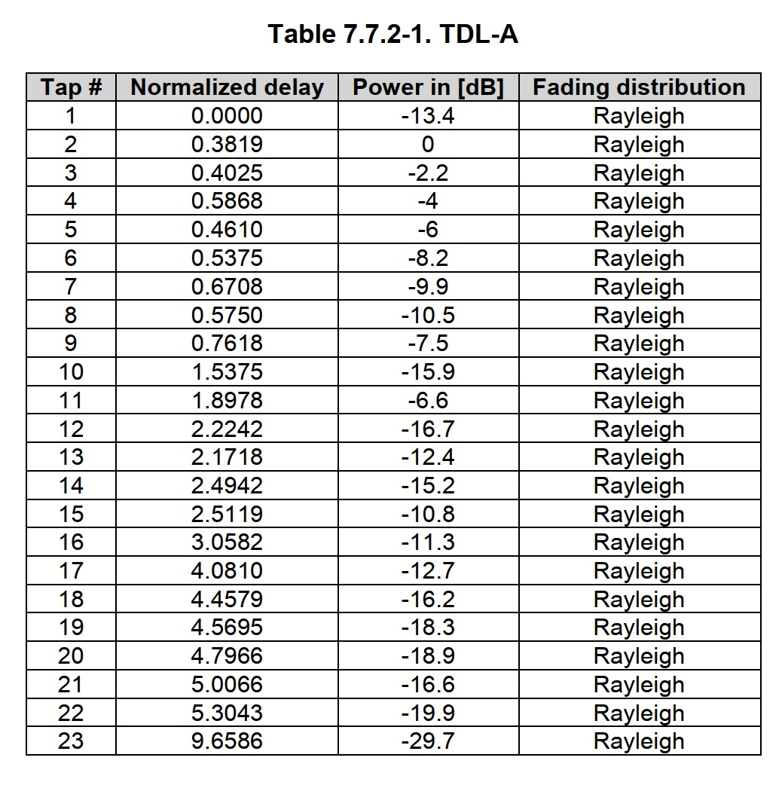

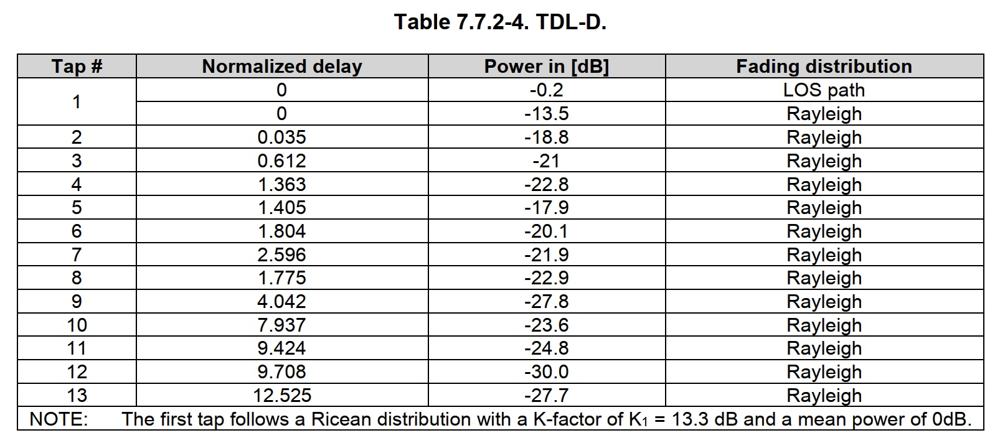

3GPP TR38.901 7.7.3 Scaling of delays定义了推荐的RMS delay值，以及如何如何根据RMS delay值和normalized delay计算得到实际delay：
$$
\tau_{n,scaled}=\tau_{n,model}DS_{desired}
$$
其中：
* $\tau_{n,scaled}$为第$n$个TAP的实际delay in ns
* $\tau_{n,model}$为第$n$个TAP的normalized delay in ns,参见上面的Table
* $DS_{desired}$为RMS delay值,下面为协议推荐的delay值

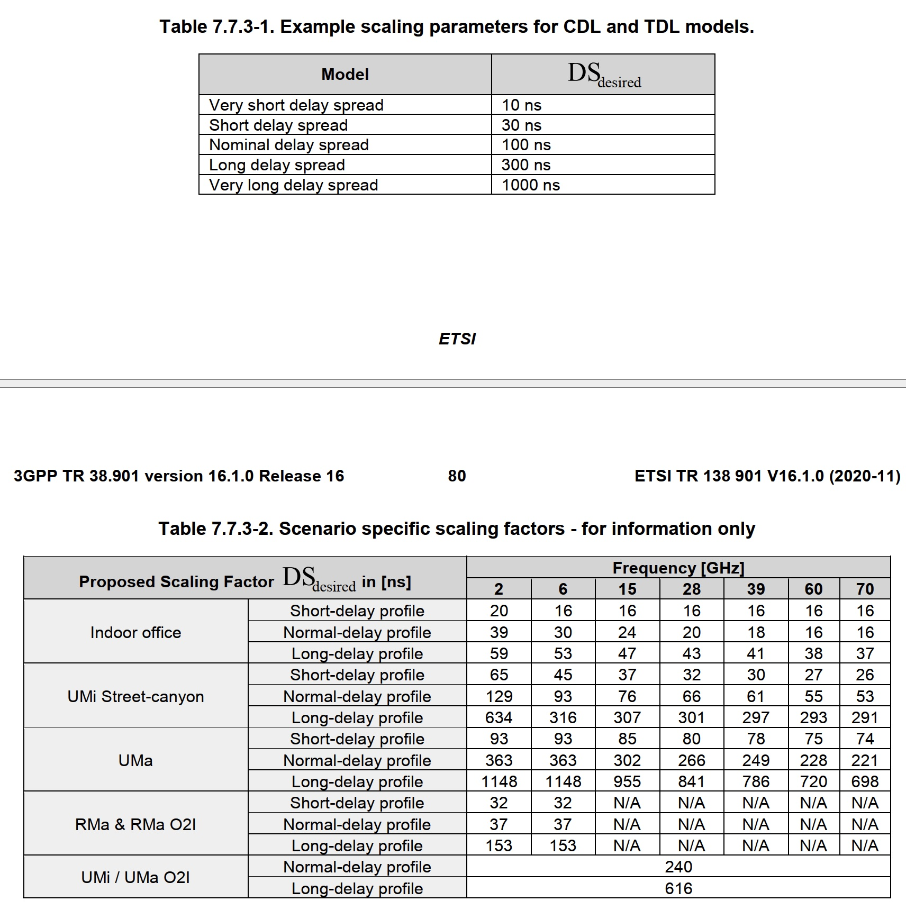

3GPP TS38.101-4列出了最大多普勒频移的几个参考值，范围从5Hz到1200Hz

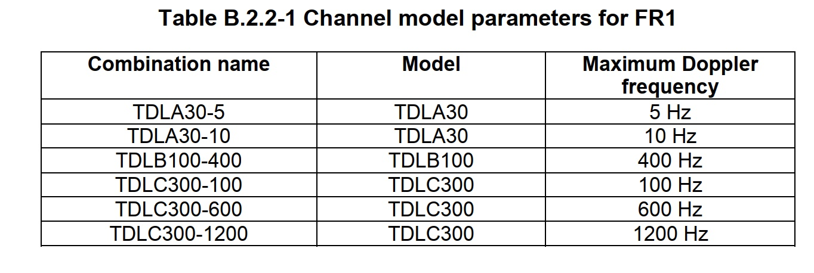

# MIMO信道
## MIMO 空间相关矩阵（spatial correlation natrix）定义
参考：https://en.wikipedia.org/wiki/Spatial_correlation_(wireless)

MIMO 空间相关矩阵公式：
$$
R_{spat}=E\{vec(H)(vec(H))^H\}
$$
其中：
* $R_{spat}$为空间相关矩阵，为Hermitian positive-definite matrix 
* $H$为$N_r \times N_t$信道矩阵
* $N_r$为接收天线数目，$N_t$为发送天线数目
* $vec(*)$按照列顺序把$H_{N_r \times N_t}$转为$N_r \times N_t$列向量

例如：$vec(\begin{bmatrix}a & b \\c & d \end{bmatrix})=\begin{bmatrix}a \\c \\b \\ d \end{bmatrix}$

## 已知MIMO 空间相关矩阵如何生成MIMO信道矩阵$H$
1. Cholesky decomposition $ R_{spat}=LL^H$，其中$L$为下三角矩阵
2. 根据信道模型生成$N_r \times N_t$个Rayleign衰落信道或Rician衰落信道，得到列向量$A$
3. 生成$vecH=LA$
4. $H=reshape(vecH,N_r, N_t)$

## 3GPP定义的MIMO空间矩阵
以下3GPP协议定义了MIMO相关矩阵
* TS36.101 B.2.3定义LTE下行MIMO相关矩阵
* TS36.104 B.5 定义上行MIMO相关矩阵
* TS38.101-4 B.2.3定义5G下行MIMO相关矩阵
* TS38.104 G.2.3 定义5G上行MIMO相关矩阵

协议定义了两种阵列：
1. Uniform Linear Array (ULA)均匀线性阵列

$R_{spat}=R_T\otimes R_R$

其中：
* $R_{spat}$为MIMO相关矩阵
* $R_T$为发送端相关矩阵，$R_R$为接收端相关矩阵

对于下行信道，$R_{spat}=R_{gNB}\otimes R_{UE}$

对于上行信道，$R_{spat}=R_{UE}\otimes R_{gNB}$

2. Cross Polarized Antennas (X-pol)极化天线阵列.
$R_{spat}=P(R_T\otimes \Gamma \otimes R_R)P^T$

其中：
* $R_{spat}$为MIMO相关矩阵
* $R_T$为发送端相关矩阵，$R_R$为接收端相关矩阵
* $\Gamma$为极化相关矩阵(polarization correlation matrix)
* $P$是转置矩阵

TS38.101-4 和TS38.104中定义的MIMO相关矩阵非常类似，但是还是有些区别，比如37.104中定义的gNB支持1/2/4/8根天线，而38.101-4中不支持8天线。

$R_{spat}$是半正定矩阵，但是定点量化为Q.4时结果无法满足，所以协议中增加了$a$scaling factor 来保证。浮点运算不需要。
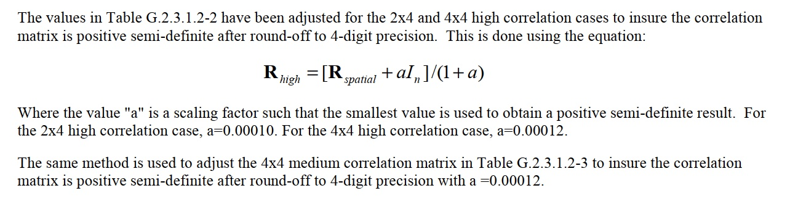

## Uniform Linear Array (ULA)均匀线性阵列 MIMO相关矩阵

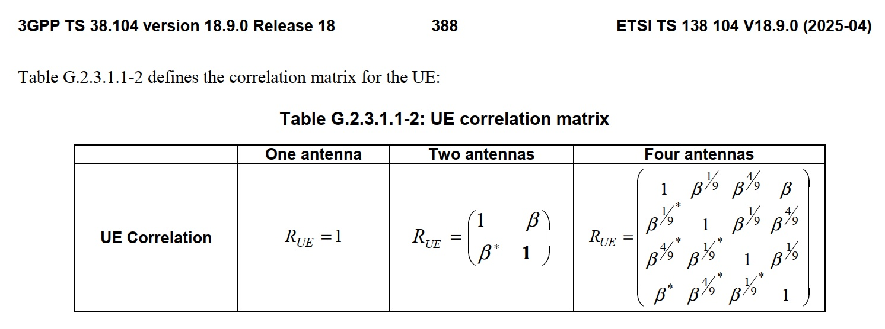

下行相关系数：
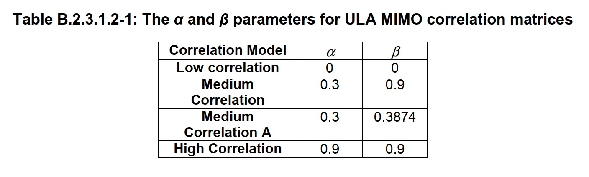

上行相关系数：
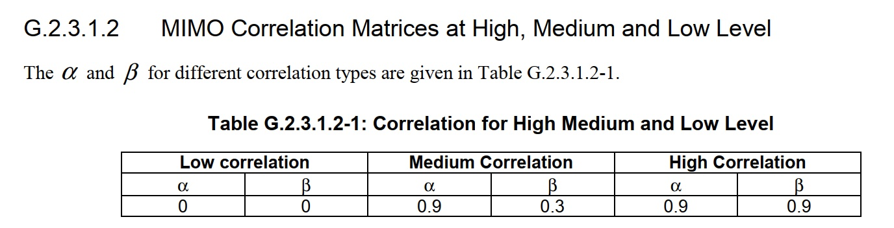

## Cross Polarized Antennas (X-pol)极化天线阵列
下行$\Gamma$矩阵(38.101-4)
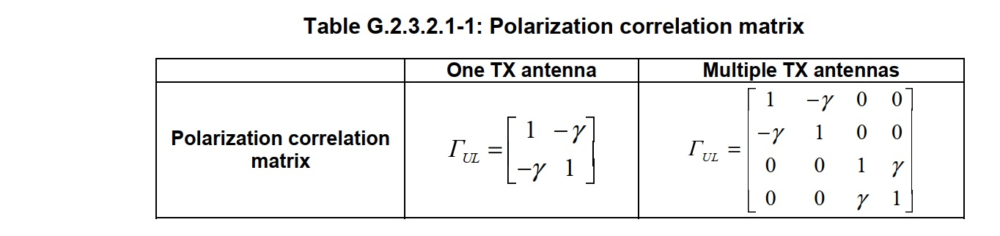

上行$\Gamma$矩阵(38.104)
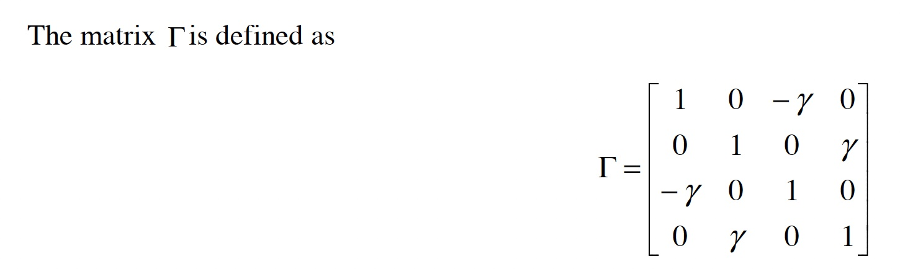

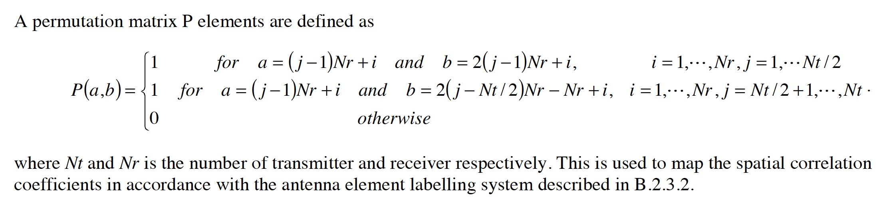

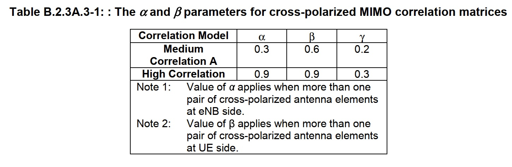

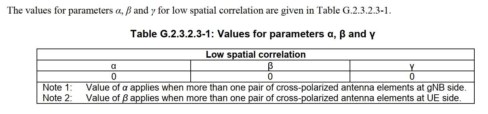

# OFDM系统如何仿真载波频偏和多普勒频偏下的信道模型

## ODFM符号离散发送信号

生成OFDM发送信号需要经过：
1. 每个symbol频域数据做IDFT转为时域数据，需要补偿fractional时间偏差
2. Add CP，每个symbol头部添加CP
3. 合并所有symbol 数据
4. 所有时域数据经过filter和过采样，一般输出数据采样频率为[$245.76Mhz,491.52MHz,983.04MHz$]
5. 载波频偏处理
6. 整数时间偏差处理
***
step 1: symbol频域数据做IDFT转为时域数据系统模型：
$$
\begin{align}
x_{m}(n)&=\displaystyle\sum\limits_{k=0}^{N-1}\frac{1}{N}X_{m,k}e^{j2\pi kf_c(n(1+\rho)T_C+{D_m\rho-T_{A,frac}})} \nonumber \\
&=\displaystyle\sum\limits_{k=0}^{N-1}\frac{1}{N}X_{m,k}e^{j2\pi kf_c(D_m\rho-T_{A,frac})}e^{j2\pi kf_cn(1+\rho)T_C} \nonumber \\
&=\displaystyle\sum\limits_{k=0}^{N-1}\frac{1}{N}X_{m,k}e^{j2\pi kf_c(D_m\rho-T_{A,frac})}e^{j2\pi kn(1+\rho)/N}  \\
& \approx \displaystyle\sum\limits_{k=0}^{N-1}\frac{1}{N}X_{m,k}e^{j2\pi kf_c(D_m\rho-T_{A,frac})}e^{j2\pi kn/N} 
\end{align}
$$ 
其中：
* $X_{mk}$为symbol $m$ 子载波$k$频域信号
* 子载波带宽$f_c$，一般为15KHz/30KHz
* $T_c$为期望采样周期,一般为$\frac{1}{f_c \times [512/1024/2048/4096]}$,比如SCS30KHz, 4096Point FFT, $T_C=\frac{1}{30KHz*4096} \approx 8.1ns$
* $N=\frac{1}{f_cT_C}$为IFFT size
* 发送机晶体振荡器相对频偏$\rho$，这个偏差会导致(1)载波频偏(2)采样时钟偏差(3)每个symbol定时漂移

  发送机发送的载波频率= $f_i(1+\rho)$,发送频率偏移$f_i\rho$

  发送机时域采样频率为$f_c(1+\rho)$，采样周期为$\frac{1}{f_c(1+\rho)}\approx T_c(1-\rho)$，

  假设$\rho >0$，则相对于接收机，发送机发送的数据一直在缓慢前移。
* $x_{m}(n)$中$n$代表在$T_C$采样周期下的数据
  
  如果实际采样周期为$T_c(1-\rho)$,在$n$时刻发送的是$n(1+\rho)$数据，所以上面信号模型中取$n(1+\rho)T_C$，而不是$n(1-\rho)T_C$
* $D_m$为symbol$m$相对时间参考点的的时间间隔，
  
  时间参考点一般为产生的仿真数据起始时刻。假设生成10ms数据，$f_c=15KHz$，一个slot长度1ms，symbol 0 CP长度为$160/30.72MHz=5.2us$,那么slot 0 symbol0 $D_m=5.2ns$，slot 1 symbol0 $D_m=1ms + 5.2ns$,以此类推。
* $D_m\rho$为发送机晶体振荡器相对频偏$\rho$导致的定时偏差
* $ $T_s$为时域采样周期，一般输出数据采样频率为[$245.76Mhz,491.52MHz,983.04MHz$]
* $T_A$为发送机相对接收机的时间偏差，$T_A$为正代表发送机滞后发送，为负表示发送机超前发送,$T_A = T_{A,Integer}+T_{A,frac}$,其中$T_{A,Integer}=n_\delta T_s$为相对于$T_s$的整数时偏，$T_{A,frac}$为小数时偏，这个小数时偏只能在频域处理。

公式（1）$\displaystyle\sum\limits_{k=0}^{N-1}\frac{1}{N}X_{m,k}e^{j2\pi kf_c(D_m\rho-\delta)}e^{j2\pi kn(1+\rho)/N}$为考虑了采样时钟偏差$1+\rho$后的信道模型，实现的时候不能采用IDFT，只能对每个子载波计算时域信号，然后叠加所有子载波的时域信号。

考虑到$rho$一般小于$1ppm$,公式（1）可以简化为公式（2）$\displaystyle\sum\limits_{k=0}^{N-1}\frac{1}{N}X_{m,k}e^{j2\pi kf_c(D_m\rho-\delta)}e^{j2\pi kn/N}$,首先对每个子载波数据做$e^{j2\pi kf_c(D_m\rho-\delta)}$相位移动，然后做IDFT转为时域数据。

---
step 5: 载波频偏处理
$$
x_f(n)=x(n)e^{j2\pi f_i\rho nT_s}
$$
* 载波频率$f_i$，从几百兆到几GHz, $f_i\rho$为载波频偏
* $x(n)$为filter, 过采样后的时域数据

***
step 6：整数时间偏差处理

$ x_t(n)=x_f(n-n_\delta)$为发送机发送出去的信号

其中：$n_\delta$为相对于$T_s$的整数时偏

***
一个例子：

假设一个5G carrier，载波频率$f_i=3GHz$，带宽100MHz，子载波带宽$f_c=30KHz$，
时域IDFT后采样频率为$122.88MHz$,经过filter和过采样后采样频率为$983.04MHz$,
晶体振荡器相对频偏$\rho=0.1ppm$，发送机和接收机间符号定时偏差$T_A=10ns$

根据上面公式可以得到：
* 期望采样时钟$T_C=1/122.88MHz$
* filter和过采样后采样周期为$T_s=1/983.04MHz$
* 载波频偏 $f_i*\rho=3*10^9*0.1*10^{-6}=300Hz$
* FFT size $N=1/(f_cT_c)=4096$
* $T_A=10*T_s+0.17ns$, $T_{A,frac}=0.17ns$,$n_\delta=10$

## MIMO OFDM时域信号经过多径信道后的离散接收信号为：

假设有$L$个多径信道，每一径信道为MIMO信道模型，信道响应为$\begin{bmatrix}h_{1,1}(n) &...  & h_{1,N_t}(n) \\ ... &... &...\\h_{N_r,0}(n) &... & h_{N_r,N_t}(n) \end{bmatrix}$

其中:
* $N_r$为接收天线数目，$N_t$为发送天线数目
* $h_{i,j}(n)$为发送天线$j$到接收天线$i$的时域信道响应,$h_{i,j}(n)$为Rayleign衰落信道或Rician衰落信道.文章前面章节介绍了如何生成MIMO信道的$h_{i,j}(n)$矩阵

***

第径$l$的接收信号为：
$$
\begin{bmatrix}y_{l,1}(n) \\... \\ y_{l,N_r}(n) \end{bmatrix}
=\begin{bmatrix}h_{1,1}(n) &...  & h_{1,N_t}(n) \\ ... &... &...\\h_{N_r,0}(n) &... & h_{N_r,N_t}(n) \end{bmatrix}
\begin{bmatrix}x_{t,1}(n) \\... \\ x_{t,N_t}(n) \end{bmatrix}
$$
其中：
* $x_{t,j}(n)$为第$j$天线发送的数据
* $y_{l,i}$为第$i$天线接收的数据

$h_{i,j}(n)$模型为：
$$
h_{i,j}(n） = \frac{1}{\sqrt{K+1}}h_{Rayleigh}[n])+\sqrt\frac{K}{K+1}e^{j(2\pi f_{Do}T_sm+\phi_o)}
$$
$K>0$ 代表接收信号经过了$e^{j(2\pi f_{Do}T_sm+\phi_o)}$多普勒频移

注意这个多普勒频移值和Rayleign衰落信道和Rician衰落信道中的最大多普勒频移不一样。Rayleign衰落信道和Rician衰落信道中的最大多普勒频移是用于产生信道的时变特性，这个值是Rician衰落信道$f_{Do}$为直射径的多普勒频移。对Rayleign衰落信道，这个值为0
***
多径接收信道合并：
$$
y_i(n)=\displaystyle\sum\limits_{l=0}^{L-1} P_ly_{l,i}(n-n_{t,l}) +noise_i(n)+Interference_i(n)
$$
其中：
* $y_i(n)$为第$i$天线接收的数据
* $P_l$为第$l$径功率
* $n_{t,l}$为第$l$径向对采样周期$T_s$的时偏，为了计算方便，每径的时偏都归一化为$T_s$的整数倍
* $noise_i(n)$为第$i$接收天线白噪声
* $Interference_i(n)$为第$i$接收天线干扰信号，可以来自邻区，或者MU-MIMO中同调度的其他UE信号

***
总结下来，生成5G信道模型需要考虑如下参数：
* 发送机相对接收机的定时偏差
* 发送机相对接收机的晶体振荡器偏差
* 最大多普勒频移
* 多径信道分布，包括径的总数，以及每一径的delay，功率，Rayleign衰落信道或者Rician衰落信道,Rician衰落信道还需要提供$K$值和直射径多普勒频移

  TDL模型提供了几种多径信道分布类型
* $N_t$发送天线个数
* $N_r$接收天线个数
* MIMO信道相关矩阵
* 噪声功率
* 干扰信号，可以来自邻区，或者MU-MIMO中同调度的其他UE信号

note: install Markdown Preview Mermaid Support externsion in Vscode to display the diagram
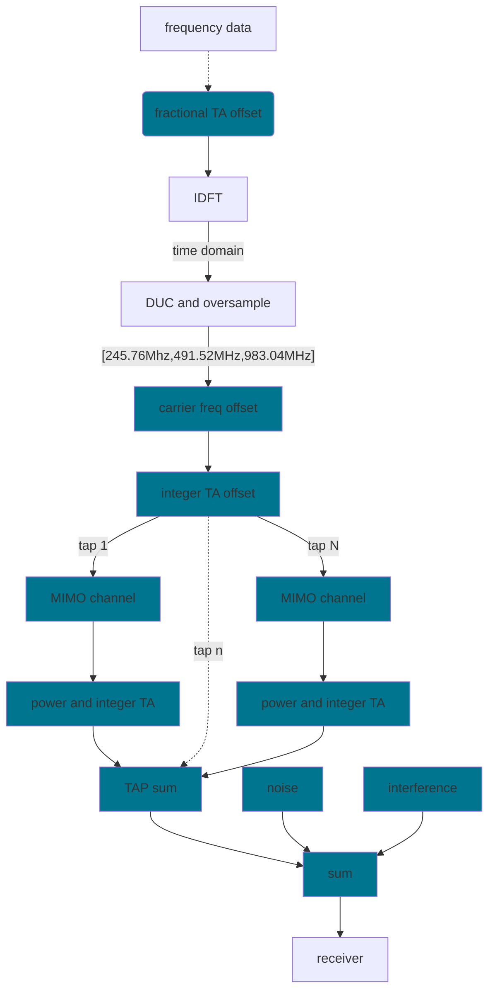
上图为信号经过信道模型的流程图,蓝色为信道模型处理模块。

* fractional TA offset
 
  每个子载波数据做$e^{j2\pi kf_c(D_m\rho-T_{A,frac})}$相位调整
* carrier freq offset
 
  增加载波频偏$e^{j2\pi f_i\rho nT_s}$

* integer TA

  $ x_t(n)=x_f(n-n_\delta)$

* MIMO channel

  每径经过MIMO channel，对于Rician信道，同时包含增加多普勒频移$f_{d,L}$

* power and integer TA
  每径经过功率调整和TA

* TAP sum
  
  多径信号合并

* noise

  添加噪声

* interference

  添加干扰，干扰为同频邻区干扰或者/和 MU-MIMO co-scheduled UE干扰

* sum

  合并TAP信号，噪声和干扰

  